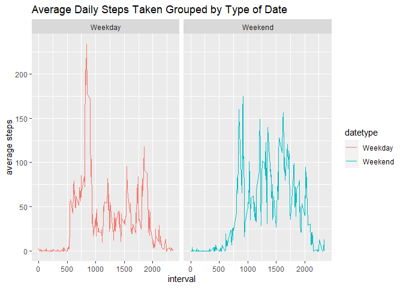

Global settings

```r
knitr::opts_chunk$set(warning=FALSE) # ignore any warnings
```

Before starting the project, let's import the **ggplot2** libraries for plotting purposes


```r
library(ggplot2)
library(knitr)
```
## Loading and preprocessing the data
The data itself can be found inside the zipped file `activity.zip`. Extract it and we will get the `activity.csv` file

```r
data <- read.csv('./activity.csv')
data$date <- as.POSIXct(data$date, '%Y-%m-%d')
week_day <- weekdays(data$date)
activity <- cbind(data, week_day)

summary(activity)
```

```
##      steps             date               interval        week_day        
##  Min.   :  0.00   Min.   :2012-10-01   Min.   :   0.0   Length:17568      
##  1st Qu.:  0.00   1st Qu.:2012-10-16   1st Qu.: 588.8   Class :character  
##  Median :  0.00   Median :2012-10-31   Median :1177.5   Mode  :character  
##  Mean   : 37.38   Mean   :2012-10-31   Mean   :1177.5                     
##  3rd Qu.: 12.00   3rd Qu.:2012-11-15   3rd Qu.:1766.2                     
##  Max.   :806.00   Max.   :2012-11-30   Max.   :2355.0                     
##  NA's   :2304
```

## What is mean total number of steps taken per day?

```r
total_steps <- with(activity, aggregate(steps, by=list(date), FUN=sum, na.rm=TRUE))
names(total_steps) <- c('date', 'steps')

hist(total_steps$steps, main='Total Number of Steps Each Day', xlab='Steps', breaks=seq(0,25000, by=2500))
```

<!-- -->

```r
mean_total_steps <- mean(total_steps$steps)
median_total_steps <- median(total_steps$steps)
```
Average number of total steps taken each day: 9354.2295082  
Median number of total steps taken each day: 10395


## What is the average daily activity pattern?
- Make a time series plot (i.e. `type = “l”`) of the 5-minute interval (x-axis) and the average number of steps taken, averaged across all days (y-axis)

```r
avg_daily_activity <- aggregate(activity$steps, by=list(activity$interval), FUN=mean, na.rm=TRUE)
names(avg_daily_activity) <- c('interval', 'mean')
plot(avg_daily_activity$interval, avg_daily_activity$mean, type='l', xlab='interval', ylab='average steps',
     main='Average Daily Activity Pattern')
```

<!-- -->

- Which 5-minute interval, on average across all the days in the dataset, contains the maximum number of steps?

```r
avg_daily_activity[which.max(avg_daily_activity$mean), ]$interval
```

```
## [1] 835
```

## Imputing missing values

Note that there are a number of days/intervals where there are missing values (coded as `NA`). The presence of missing days may introduce bias into some calculations or summaries of the data.
First, let's count the number of `NA` in our data:


```r
sum(is.na(activity$steps))
```

```
## [1] 2304
```

Now, devise a strategy for filling in all of the missing values in the dataset. The strategy does not need to be sophisticated. For example, you could use the mean/median for that day, or the mean for that 5-minute interval, etc. Then, create a new dataset that is equal to the original dataset but with the missing data filled in.


```r
imputer <- avg_daily_activity$mean[match(activity$interval, avg_daily_activity$interval)]
imputed_activity <- transform(activity, steps=ifelse(is.na(activity$steps), yes=imputer, no=activity$steps))
total_imputed_steps <- aggregate(steps ~ date, imputed_activity, FUN=sum)
names(total_imputed_steps) <- c('date', 'steps')
```

Let's look at the new histogram on the new imputted data


```r
hist(total_imputed_steps$steps, main='Total Number of Steps Each Day (After Imputed)', xlab='Steps', breaks=seq(0,25000, by=2500))
```

<!-- -->


```r
mean_total_imputed_steps <- mean(total_imputed_steps$steps)
median_total_imputed_steps <- median(total_imputed_steps$steps)
```
Average number of total steps taken each day after imputation: 1.0766189\times 10^{4}  
Median number of total steps taken each day after imputation: 1.0766189\times 10^{4}

## Are there differences in activity patterns between weekdays and weekends?

For this part, we should create a new factor variable which divide the data into "weekday" and "weekend"

```r
activity$date <- as.Date(strptime(activity$date, format='%Y-%m-%d'))
activity$datetype <- sapply(activity$date, function(x) {
  if(weekdays(x) == 'Saturday' | weekdays(x) == 'Sunday') {
    y <- 'Weekend'
  } else {
    y <- 'Weekday'
  }
})
```

Now we can plot a time series on a 5-minute interval and the number of average of steps taken across all weekdays and weekends.

```r
activity_by_type <- aggregate(steps ~ interval + datetype, activity, FUN=mean, na.rm=TRUE)
ggplot(activity_by_type, aes(x=interval, y=steps, color=datetype)) + 
  geom_line() + 
  facet_wrap(~datetype, ncol=2, nrow=1) + 
  labs(title='Average Daily Steps Taken Grouped by Type of Date', x='interval', y='average steps')
```

<!-- -->

